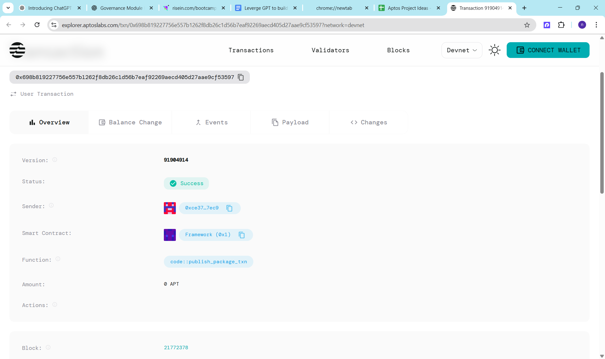

# 🗳️ On-Chain Governance with Move

## 📌 Project Title
**Aptos-Based Decentralized Governance Smart Contract**

## 📖 Project Description

This project implements a basic on-chain governance system using the Move language on the Aptos blockchain. It allows users to create proposals and cast votes on them. The system can be extended to include token-based voting, NFT-gated access, and more complex governance rules.

It is designed to be lightweight, modular, and easily integrated into any dApp that requires proposal-based decision-making.

## 🎯 Project Vision

The vision is to build a transparent, secure, and decentralized mechanism that enables community-driven decisions through proposals and voting on the blockchain. This smart contract forms the base layer for future decentralized autonomous organization (DAO) tooling on Aptos.

## ✨ Key Features

- 🗳️ **Proposal Creation**: Any account can create a new proposal with a description.
- ✅ **Single-Vote Enforcement**: A voter can vote only once per contract instance.
- 🔐 **State Stored On-Chain**: All data (proposals, votes, voter list) are stored on-chain.
- 🔍 **Modular Design**: Easily extendable to support weighted voting, voting deadlines, etc.
- 🔗 **NFT Integration Ready**: Designed to connect with an NFT collection to restrict voting rights.

## 🔮 Future Scope

- 🧠 **Weighted Voting**: Implement vote weighting based on token or NFT holdings.
- ⏳ **Voting Periods**: Add time-based restrictions for open/closed proposals.
- 🧾 **Proposal Metadata**: Allow additional fields like proposal title, category, etc.
- 🔒 **Access Control**: Restrict proposal creation to certain roles (e.g., NFT holders).
- 📈 **Analytics Dashboard**: Build a frontend to display proposals and results.
- 🧩 **Integration**: Support for DAO tooling, frontend interfaces, and Aptos wallets.

## 📄 Contract Details

0x698b819227756e557b1262f8db26c1d56b7eaf92269aecd405d27aae9cf53597
